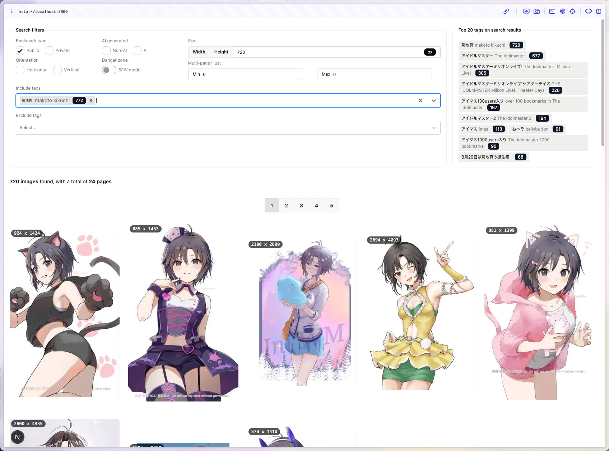

pixiv Bookmarks Visualizer
===

Performing complex search with your pixiv bookmarks.



Features
---

- Filter illusts by bookmakrs type (Public / Private)
- Search illust by tags, serch query can be both in Japanese, and English
- Filter illusts by orientation (Vertical / Horizontal). Great use when looking for new desktop or mobile wallpaper.
- Filter illusts by minimum pixel resolution on either axis (Width / Height)
- Actual resolution indicator on top-left corner of each illusts.

Preload data
---

> [!NOTE]
> Our backend engine are now using SQLite to store all of your bookmarks' data. This will reduce the time to load all of your bookmarks data into memory, and also reduce the time to search for specific illusts.
> This may have performance degradation for HDD users.

> [!WARNING]
> This project is only built for running locally, please do not deploy to public internet otherwise it might not be working properly, or all of your private bookmarks will be public

First, you have to get your account refresh token in any mean nessesary. I recommend [this script](https://github.com/eggplants/get-pixivpy-token) to obtain refresh token.

Then, make your own `.env` file based on `.env.example` by providing refresh token and your user ID into the file.

```
cp .env.example .env
```

After that, install dependencies reqired for this project and run a script to obtain all of your bookmarks. Script will take a while to scrape data, depending on how much bookmarks in your account.

```
pnpm i
pnpm db:init
pnpm build:data
```

Optionally, you can pre-download **all** illusts into local machine right away to reduce frist-load image time in browser. Each image will consume avarage of *40KB* of storage (minimum 10KB, maximum ~100KB). To do this run following command.

```
node -r @swc-node/register ./tools/preloadImage.ts
```

Pixiv CDN may not prepared you to access very old illusts which could cause some preload image to fail. Just running preload command continuously until no any `fail: ` emit into output.

Notes for うごイラ illusts
---

By default this web app will not try to display image as gifs since it take a lot of time to response back. If you want *うごイラ* illusts to be animated run following command to generated (somewhat) highly optimized animated WebP.

```
node -r @swc-node/register ./tools/ugoira.ts
```

Also, [`img2webp`](https://developers.google.com/speed/webp/docs/img2webp) is required. Install on your macOS by running `brew install webp`

Script expected to fail multiple times since there's a rate limit on Pixiv API. Wait for about 3-5 minutes for rate limit quota to refill and run the script again until scripts finished without any errors.

Spin-up a server
---

As I said, you should be aware of where did you run this server on. Running this application in public network could compromise your private bookmarks.

There're 3 method to start a server, but I do prefer a thrid method

### Method 1: Start as development server

```
pnpm dev
```

### Method 2: Start as production server (less pre-compile time)

```
pnpm build
pnpm start
```

### Method 3: Start as container service

```
docker-compose up -d
```
